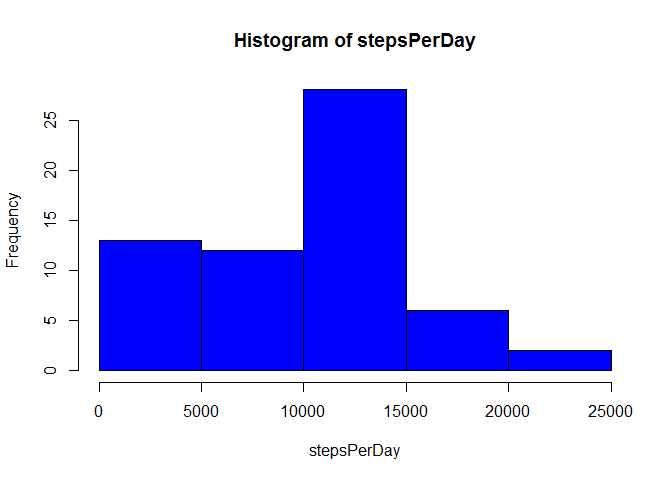
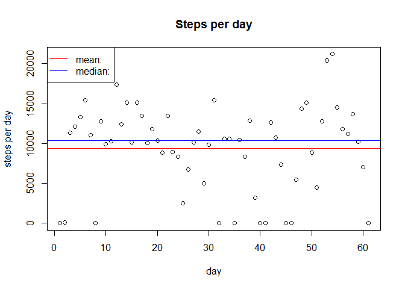
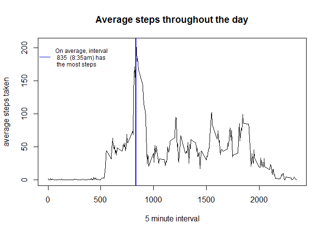
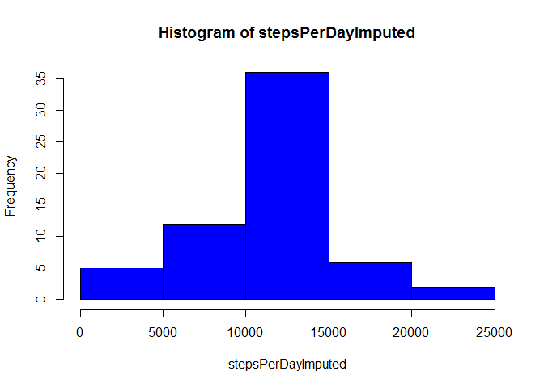
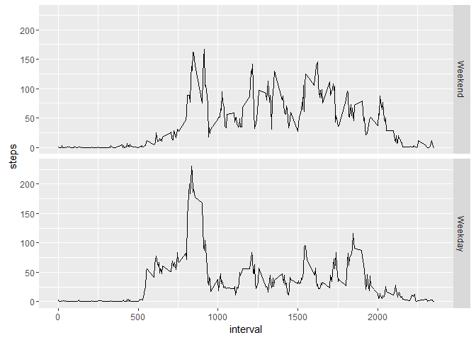

# Reproducible Research: Peer Assessment 1
## Loading and preprocessing the data

```r
library(ggplot2)
```

```
## Warning: package 'ggplot2' was built under R version 3.2.4
```

```r
activity <- read.csv("./activity/activity.csv")
```

#
# What is mean total number of steps taken per day?
#

#1. Calculate the steps taken per day

```r
stepsPerDay <- with(activity,tapply(steps,date,sum,na.rm=T))
meanStepsPerDay <- mean(stepsPerDay)
medianStepsPerDay <- median(stepsPerDay)
```

#2. Histogram of the total number of steps taken each day

```r
par(mfrow=c(1,1))
hist(stepsPerDay,col = "blue")
```



#3. Mean and median of total steps per day

```r
print(paste("Mean steps per day:",round(meanStepsPerDay,0)))
```

```
## [1] "Mean steps per day: 9354"
```

```r
print(paste("Median steps per day:",round(medianStepsPerDay,0)))
```

```
## [1] "Median steps per day: 10395"
```

```r
plot(stepsPerDay, xlab="day",ylab="steps per day", main="Steps per day")
abline(h=mean(stepsPerDay), col="red")
abline(h=medianStepsPerDay, col="blue")
legend(x='topleft',legend=c("mean:","median:"),col=c("red","blue"),
  lwd=1,lty=c(1,1),pch=c(NA,NA) )
```




#
# What is the average daily activity pattern?
#

#1. time series plot of average steps taken by 5 minute interval

```r
meanByInterval <- with(activity,tapply(steps,interval,mean,na.rm=T))
plot.new()
plot(unique(activity$interval),meanByInterval,type="l",
     xlab="5 minute interval",ylab="average steps taken",
     main="Average steps throughout the day")


#2. which 5 min interval, on average, contains the most steps?
indx <- which(meanByInterval == max(meanByInterval)) #find index of biggest value
bigValInterval <- unique(activity$interval)[indx]  #interval with the biggest value
abline(v=bigValInterval,col="blue",lwd=2)

legend(x='topleft',legend=paste("On average, interval \n",
       bigValInterval," (8:35am) has\n the most steps"),col=c("blue","blue"),
       lwd=1,lty=c(1),pch=c(NA), cex=.75, bty="n")
```



#
# Imputing missing values
#

#1. Calculate the number of missing values in the dataset

```r
missingVals <- sum(is.na(activity$steps))
print(paste("There are",missingVals,"missing values in the dataset"))
```

```
## [1] "There are 2304 missing values in the dataset"
```


#2. Create imputed values using mean by interval

```r
missingIndx <- is.na(activity$steps) #boolean index of observations with NA
missingIntervals <- as.character(activity[missingIndx,3]) #interval values for NA
missingImputedVals <- meanByInterval[missingIntervals] #mean value for each NA
```


#3. Create a new dataset with imputed values

```r
activityImputed <- activity #create a new dataset
activityImputed[missingIndx,1] <- missingImputedVals #replace NA with imputed values
```

#4. New histogram of steps taken each day, what is the impact of imputed values?

```r
stepsPerDayImputed <- with(activityImputed,tapply(steps,date,sum))
meanStepsPerDayImputed <- mean(stepsPerDayImputed)
medianStepsPerDayImputed <- median(stepsPerDayImputed)
hist(stepsPerDayImputed,col = "blue")
```



```r
meanDiff <- meanStepsPerDayImputed - meanStepsPerDay
medianDiff <- medianStepsPerDayImputed - medianStepsPerDay

print(paste("After imputing values the mean is:",
            paste(round(meanStepsPerDayImputed,0),".",sep=""),
            "A difference of",
            round(meanDiff,0),"or",
            paste(round(meanDiff/meanStepsPerDay*100,0),"%",sep="") ) )
```

```
## [1] "After imputing values the mean is: 10766. A difference of 1412 or 15%"
```

```r
print(paste("After imputing values the median is:",
            paste(round(medianStepsPerDayImputed,0),".",sep=""),
            "A difference of",
            round(medianDiff,0),"or",
            paste(round(medianDiff/medianStepsPerDay*100,0),"%",sep="") ) )
```

```
## [1] "After imputing values the median is: 10766. A difference of 371 or 4%"
```

```r
print("Imputing values has raised the mean and median")
```

```
## [1] "Imputing values has raised the mean and median"
```

```r
#
# Are there differences in activity patterns between weekdays and weekends?
#

#1. Add a new variable to the dataset to indicate weekend or weekday
dayOfWeek <- weekdays(as.Date(activityImputed$date,"%Y-%m-%d")) #
weekEndIndx <- dayOfWeek %in% c("Saturday","Sunday")
weekDayIndx <- !(dayOfWeek %in% c("Saturday","Sunday"))
activityImputed$daytype <- as.factor(rep(NA,dim(activityImputed)[1])) #create new column in dataset
levels(activityImputed$daytype) <- c("Weekend","Weekday")
activityImputed[weekEndIndx,"daytype"] <- as.factor("Weekend")
activityImputed[weekDayIndx,"daytype"] <- as.factor("Weekday")

#2. Make a panel plot time series of 5 minute intervals for weekdays and weekends
ggplot(activityImputed) + geom_line(aes(interval,steps),
       stat="summary",fun.y="mean") + facet_grid(daytype~.)
```



